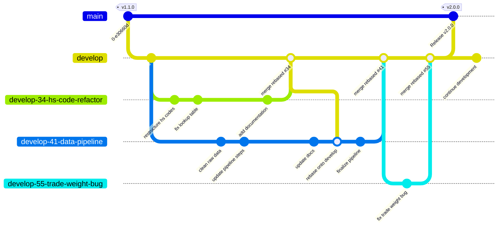

# Contributing to ARTIS

Thank you for contributing to the ARTIS model package. This document describes the git an GitHub software development workflow and conventions for the `artis` R package repository. 


## Table of Contents 

- [🧱 GitHub Workflow Components](#github-workflow-components)
  - [Definitions](#definitions)
  - [Details: Issues](#details-issues)
    - [Theme/Epic Lifecycle](#themeepic-lifecycle)
    - [Sub-issue Lifecycle](#sub-issue-lifecycle)
  - [Details: Issue/PR Status Categories](#details-issuepr-status-categories)
  - [Details: Branches](#details-branches)
    - [Branch Naming](#branch-naming)
    - [Branch Workflow Diagram](#branch-workflow-diagram)
- [🍉 The Workflow](#the-workflow)
- [📋 Prepare for Merging Work into `develop`](#prepare-for-merging-work-into-develop)
- [🎩 Rebasing Before Merge](#rebasing-before-merge)
- [🤖 Automated Workflows](#automated-workflows)
- [💃 Code Style](#code-style)

## GitHub Workflow Components 🧱

### Definitions

There are a few key components to our git and GitHub software development workflow for ARTIS. They are defined below as they relate to ARTIS development:

- **Issues** — GitHub's built-in tool for tracking bugs, feature requests, tasks, and discussions within a repository. Issues can be assigned, labeled, and linked to PRs and project boards. In ARTIS, issues are structured in two tiers: 
    - `Theme/Epic` parent issues for large bodies of work, and 
    - "sub-issues" for discrete tasks within a theme/epic.

- **Branches** — An isolated copy of the codebase where changes can be made without affecting other branches. Branches allow multiple lines of work to proceed in parallel and are merged back together when complete. In ARTIS, a Gitflow-style model is used with:
    - The `main` branch for stable releases,
    - the `develop` branch as the integration branch, and 
    - short-lived "feature branches" for each theme/epic.

- **Pull Requests (PRs)** — A GitHub mechanism for proposing that changes on a feature branch be merged into another branch. PRs provide a dedicated space for code review, discussion, checklist tracking, and linking related issues before changes are integrated. **In ARTIS, each PR corresponds to one theme/epic issue and targets `develop`.**

- **Projects** — A GitHub project board for organizing and tracking work across issues and PRs using a customizable status-based workflow. In ARTIS, all issues move through statuses (Backlog → Ready → In Progress → Needs Review → Done) on the project board, with some transitions automated via GitHub Actions.

- **Milestones** — A GitHub feature for grouping issues and PRs into a named target, typically tied to a version or release goal. Milestones display a completion percentage as issues are closed. In ARTIS, milestones correspond to versioned releases (e.g., `3.0`).

- **Releases** — A GitHub feature for publishing a named, versioned snapshot of a repository at a specific commit, typically accompanied by release notes. In ARTIS, releases are tagged on `main` using simplified semantic versioning (e.g., `v3.0`) and represent stable, production-ready states of the codebase.

- **GitHub Actions** — A CI/CD and automation platform built into GitHub that runs workflows in response to repository events such as pushing code or updating a PR. In ARTIS, Actions automate issue closure when work is marked Done and update theme/epic statuses when draft PRs are marked ready for review.

### Details: Issues

ARTIS uses two tiers of issue types to organize work:

- **Theme/Epic issues** represent a cohesive body of work (e.g., a major refactor, new feature, or data pipeline update). Each theme/epic maps to a feature branch and a single pull request.

- **Sub-issues** represent discrete tasks within an epic. They are created as child issues under the relevant theme/epic and tracked individually on the project board.

#### Theme/Epic Lifecycle

Theme/Epic issues follow this automated lifecycle:

1. Open a draft PR linked to the theme/epic with `Closes #<issue-number>` in the PR body — set theme/epic status to **In Progress** manually
2. When the draft PR is marked ready for review, the theme/epic status automatically updates to **Needs Review**
3. When the PR is merged into `develop`, the theme/epic issue automatically closes via the `Closes #` reference

#### Sub-issue Lifecycle

Sub-issues progress through statuses as work advances on the parent theme/epic branch. When a sub-issue is finished, set its status to **Done** — a GitHub Actions workflow will automatically close the issue. This drives the sub-issue progress bar on the parent theme/epic.

Do not close sub-issues manually unless correcting an error.

### Details: Issue/PR Status Categories

All issues/PRs are tracked in the GitHub Project board using the following statuses:

| Status | Meaning |
|---|---|
| Backlog | Captured but not yet prioritized or scheduled |
| Ready | Prioritized and queued for active development |
| In Progress | Actively being worked on |
| Needs Review | Work is complete and under review (theme/epics: PR is open for review) |
| Stalled | Work has paused; uncertain if or when it will resume |
| Done | Work is complete — triggers automatic issue closure |

### Details: Branches

ARTIS uses a Gitflow-style branching model with `develop` as the default branch.

| Branch | Purpose |
|---|---|
| `main` | Stable releases only — merged from `develop` at versioned release points |
| `develop` | Integration branch — all feature work targets this branch |
| `develop-<theme-epic-issue-number>-<feature/bug-name>` | Theme/Epic feature branches — branched from and merged back into `develop` |

#### Branch Naming

Feature branches should be named `develop-<theme-epic-issue-number>-<feature/bug-name>` to correspond with the Theme/Epic issue they address, e.g. `develop-34-hs-code-refactor`.

#### Branch Workflow Diagram




## The Workflow 🍉

> [!IMPORTANT] 
> Theme/Epic parent issues, feature branches, and PRs should correspond directly with each other. 

1) Create a new feature branch based on the Theme/Epic issue

    ```bash
    git checkout develop
    git pull
    git checkout -b develop-<theme-epic-issue-number>-<feature/bug-name>
    ```

2) Open a **draft PR**: `base: develop | compare: develop-<num>-<feature> `. This signals active work and starts the theme/epic's lifecycle on the project board. 
    a) Link the Theme/Epic issue in the PR metadata right-hand-side column under Development.
    b) Include a closing reference in the PR body to link the PR to the theme/epic issue and enable auto-close on merge:

    ```
    Closes #<issue-number>
    ```

    > [!NOTE] 
    > You will need to make a change on the feature branch and push to origin in order to open a draft PR. Try adding a new section to the `CHANGELOG.md` about the work. 

3) Get to work on sub-issues on the feature branch `develop-<theme-epic-issue-number>-<feature/bug-name>`. Keep your branch current with any upstream changes during active development using the fetch/rebase/push loop:

    ```bash
    git fetch
    git rebase
    git push
    ```
> [!IMPORTANT]
> The `git fetch/rebase/push` loop directly replaces a more common place `git pull/push` workflow. This is intentional to keep a linear history and avoid accidentally pulling down and overwriting your local work with unexpected changes from GitHub. 


4) When a sub-issue is complete, reference the issue number in the final commit message. 
    - For a full list of linking keywords see the related [GitHub Docs](https://docs.github.com/en/issues/tracking-your-work-with-issues/using-issues/linking-a-pull-request-to-an-issue#linking-a-pull-request-to-an-issue-using-a-keyword)


    ```
    Resolves #43 cleaned up function internal object naming and references. updated Roxygen2 header. 
    ```

5) Manually change the status of the complete sub-issue on the GitHub UI to `Done` in the right-hand-side metadata column. 

    > [!NOTE]
    > This status change event triggers the `close-issue-on-done.yml` GitHub Action 


## Prepare for Merging Work into `develop` 📋

1) Change Pull Request (PR) state from "Draft" to "Open" on GitHub UI at the bottom of the PR body.

2) Change PR status from "In Progress" to "Needs Review" on GitHub UI on the right-hand-side metadata column.

3) Work through checklists in the PR body (populated by a template) that include describing the work done, testing, documentation checks, and `git rebase` instructions to prep the branch for merging (also described below). 

4) Assign a reviewer (if applicable) and notify them directly outside of GitHub about the pending code review. 

## Rebasing Before Merge 🎩

Rebasing takes all of your feature branch commits and replays them onto the tip of `develop`. This keeps a clean, linear history and avoids tangled merge commits. It only affects your feature branch — `develop` is unchanged until you merge.

1) Rebase the feature branch onto `develop`:

    ```bash
    git checkout develop
    git pull origin develop
    git checkout develop-<feature-name>
    git rebase origin/develop
    ```

2) If there are [merge conflicts](https://docs.github.com/en/pull-requests/collaborating-with-pull-requests/addressing-merge-conflicts/about-merge-conflicts), resolve them file by file, then continue the rebase. See the [GitHub Docs](https://docs.github.com/en/pull-requests/collaborating-with-pull-requests/addressing-merge-conflicts/resolving-a-merge-conflict-using-the-command-line) for a step-by-step walkthrough.

    ```bash
    git add <conflicted-files>
    git rebase --continue
    ```

3) Re-run `devtools::check()` and address any errors and warnings

4) Push to origin. Because rebase rewrites commit history, a force-push is required. Use `--force-with-lease` rather than `--force` — it will refuse if someone else has pushed to the remote branch since your last fetch, protecting against accidental overwrites.

    If there were no conflicts:

    ```bash
    git push origin develop-<feature-name>
    ```

    If there were conflicts:

    ```bash
    git push origin develop-<feature-name> --force-with-lease
    ```

## Automated Workflows 🤖 

Automation is handled by two layers: **GitHub Actions** (repository-level workflows) and **GitHub Project workflows** (built-in project board automations).

### GitHub Actions

**Close sub-issue on Done** (org `.github` repo: `workflows/close-issue-on-done.yml`)
Triggered when a project item's Status field changes to "Done". Automatically closes the linked sub-issue with state reason `completed`. Lives in the org-level `.github` repository because `projects_v2_item` is an organization event not available to repository-level workflows. Requires the `ORG_PROJECTS_TOKEN` organization secret with Projects and Issues write permissions.

**Epic status: Needs Review on PR ready** (`artis-model`: `.github/workflows/update-epic-status-on-review.yml`)
Triggered when a draft PR is marked ready for review. Automatically sets the linked theme/epic issue's project status to "Needs Review". Requires the same `ORG_PROJECTS_TOKEN` secret.

### GitHub Project Workflows

These are built-in automations configured directly on the [ARTIS Dev project board](https://github.com/orgs/Seafood-Globalization-Lab/projects/1/workflows).

| Workflow | Filter | Action | Status |
|---|---|---|---|
| Auto-add sub-issues to project | — | Add sub-issues to project | ✅ On |
| Auto-add to project | `artis-model` issue is open | Add to project | ✅ On |
| Auto-archive items | Issue or PR is closed, updated more than 2 weeks ago | Archive item | ✅ On |
| Code changes requested | — | Set status → **Needs Review** | ✅ On |
| Item reopened | Issue or PR | Set status → **In Progress** | ✅ On |
| Pull request linked to issue | — | Set status → **Needs Review** | ✅ On |
| Pull request merged | — | Set status → **Done** | ✅ On |
| Auto-close issue | — | — | ❌ Off  |
| Pull request Approved | — | — | ❌ Off  |
| Item added to project | — | — | ❌ Off |
| Item closed | — | — | ❌ Off |

> [!NOTE]
> "Pull request merged → Done" handles the theme/epic status update on the project board when a PR is merged. "Item closed → Done" is intentionally off to avoid misrepresenting stalled issues closed as "not planned" rather than completed.

## Code Style 💃

This project follows Tidyverse style conventions. See the project `AGENTS.md` for full coding and syntax guidelines including pipe operator usage, file I/O conventions, and CLI messaging patterns.
