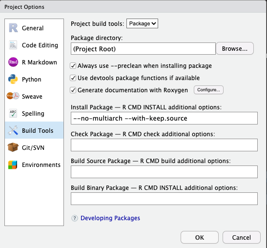
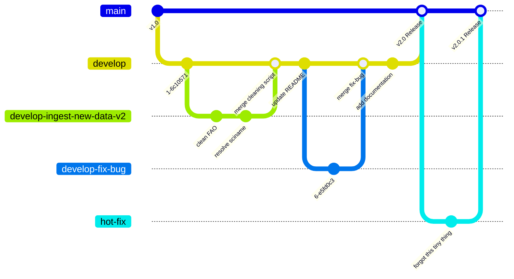
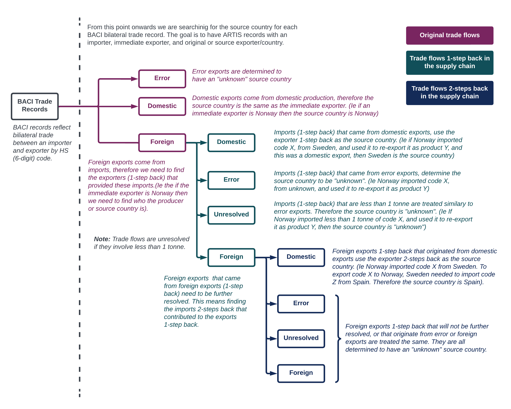
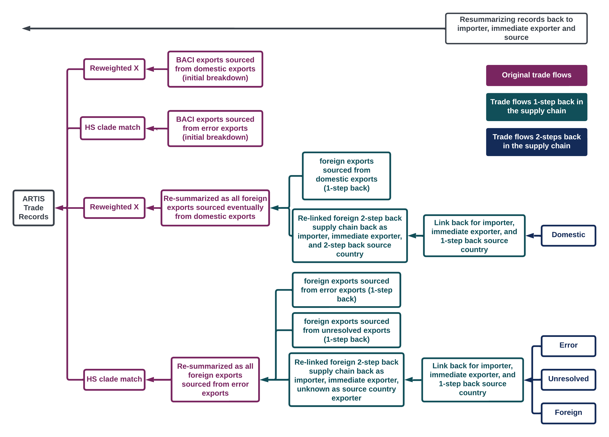
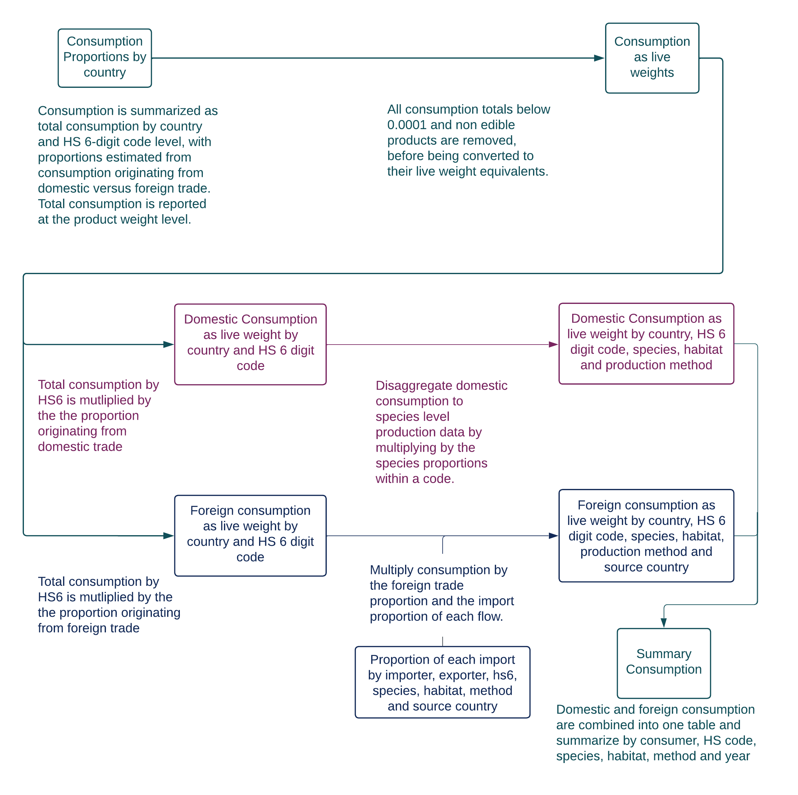
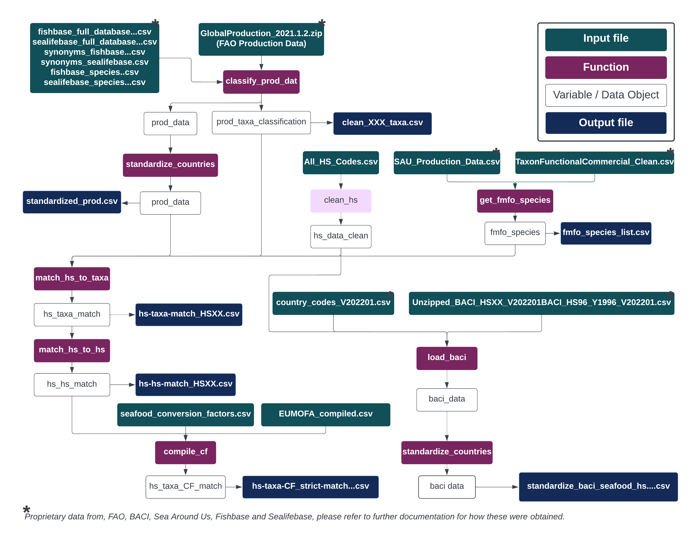
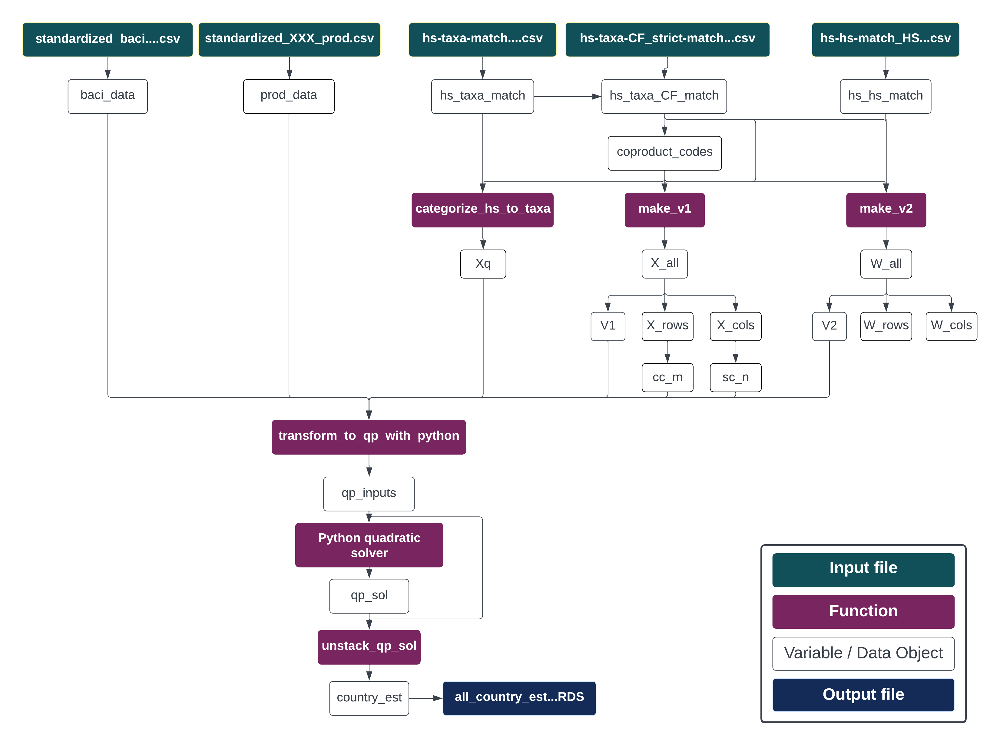
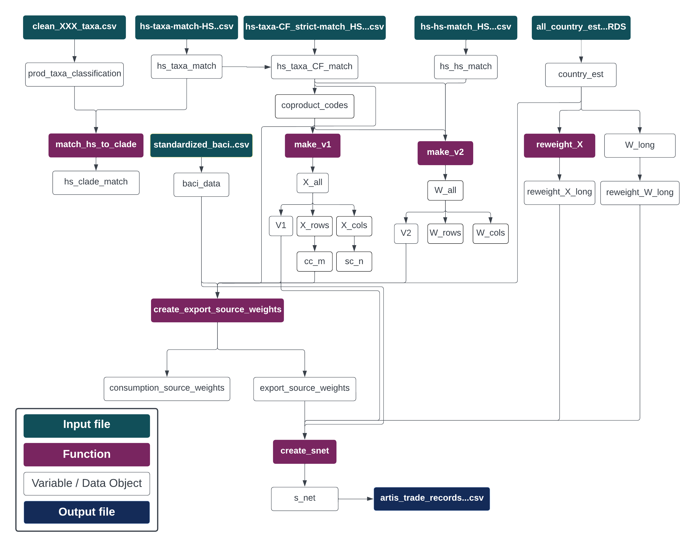

# ARTIS Model (Aquatic Resource Trade In Species)

This reposiotry contains the ARTIS model codebase and instructions to run the model. The ARTIS model has three "run modes":

- **local** mode is the full ARTIS model run on a user's local machine. This run mode will solve for all HS versions and years indicated by the user. May require significant time and compute resources to find country solutions. Currently only developed to run on Macbook pros with ARM64 architecture. 

- **demo** mode is an example of the ARTIS model run on a user's local machine. This run mode uses a small subset of the international trade data and requires significantly less time and compute resources. Currently only developed to run on a Macbook pro with ARM64 architecture.

- **aws** mode is for running the full ARTIS model on Amazon Web Services (AWS). Instructions for this run mode are located on the [`artis-hpc` repo](https://github.com/Seafood-Globalization-Lab/artis-hpc).

> [!NOTE]
> Please see the [ARTIS Manual](https://seafood-globalization-lab.github.io/artis-manual/) for information on the ARTIS model backgroup, conceptual details, output data descriptions, and data distrubution details.

## Cite this model
[](https://doi.org/10.5063/F1862DXT) - stable release version archived on KNB data repository. Same Github release version [v1.0](https://github.com/Seafood-Globalization-Lab/artis-model/releases/tag/v1.0). DOI model version *may not* be the most recent model release on Github and *is not* the development version.

```
Jessica Gephart, Rahul Agrawal Bejarano, Althea Marks, & Kelvin Gorospe. (2024).
ARTIS input data and model. Knowledge Network for Biocomplexity. doi:10.5063/F1862DXT.
```

## Installation Guide (local & demo run modes)

This project uses:
- Python 3.10.9 which can be downloaded [here](https://www.python.org/downloads/release/python-3109/)
- R can be downloaded here [here](https://www.r-project.org/)
- RStudio (IDE) can be downloaded [here](https://posit.co/download/rstudio-desktop/).

It should take approximately 10 minutes to run this full installation.

FIXIT: Specify exact versions for R installation & packages

### Creating python virtual environment

> [!WARNING]
> This protocol may not be successful for every individual local machine. The interaction in package versions and computer architecture (*i.e.* arm64 M1, M2 chips) may complicate this virtual environment set up. We are working on setting up a portable docker image to increase the reproducibility of this code.

1. Open the artis-model repository in RStudio.
2. Click on the terminal tab.
3. Run $`pwd` in the terminal.
4. Copy the result of the "pwd" terminal command.
5. Run $`python3 -m venv [RESULT FROM pwd]/venv --without-scm-ignore-files` 
    - (ie. $`python3 -m venv /home/artis-model/venv --without-scm-ignore-files`)
    - `--without-scm-ignore-files` flag disables venv version 3.13 default of creating `.gitignore` file as we already have one specific to this project
6. Run $`source venv/bin/activate` in terminal.
7. Run $`pip install -r requirements.txt` to install solver packages with specific designated versions.
8. Confirm you have successfully installed the packages qpsolvers, quadprog, cvxopt by running $`pip list`.
9. Run $`deactivate` in terminal.
10. Click on the Console tab.

> [!NOTE]
> You only need to install the solvers the first time you run this code. Warnings about the latest version of pip may also appear during the installation - these are okay, but errors are not.

### ARTIS Package Installation 
1. Click "Build" on the build tab on the top right hand side corner of RStudio.
2. Click on the dropdown arrow in the "Install" subtab within the "Build" window.
3. Click the option "Configure Build Tools..."
4. Make sure options mirror the image below and click OK.
<p align="center">
  
</p>
5. Click on the dropdown arrow in the "Install" subtab and select the option "Clean and Install"

## Development

### Branch Naming Guidelines
- **main**: Stable, released versions
- **develop**: Continuous development, all task-oriented branches are created from `develop` and merge back to `develop`.
- **Task Branches**:
  - Use `develop-` as a prefix for task branches.
  - Example: `develop-ingest-new-data-v2`.
  - Task branches should be "short-lived" and merged back into `develop` after completion.
- **hot-fix**: created from `main`, merged back into `main` for quick immediately needed fixes of release version. 
  
  
### Branch Workflow Diagram




## Demo Run Mode

Running the demo for the ARTIS model should take approximately 10 minutes. To run the demo for ARTIS run the `02-artis-pipeline.R` script and then run the `04-build-artis-timeseries.R` script.

### Outputs

The outputs of the demo will appear in the `demo/outputs` directory. Within this folder `demo/outputs/custom_ts` will contain all the final files that if run on the full model inputs would be used to create the results of the ARTIS research paper.

Please find below descriptions of main files:
- `demo/outputs/custom_ts/mid_custom_ts.csv`: This is the demo version of the main ARTIS trade records table.
- `demo/outputs/custom_ts/summary_consumption_midpoint.csv`: This is the demo version of the main ARTIS seafood consumption records table.

## Methods

### Model Conceptual Schematic
The following diagrams describes how ARTIS trade records are obtained.





### Code Conceptual Schematic
The following diagrams describe the how the codebase follows the model schematic illustrated above.





## System Requirements

> [!WARNING]
> This record is not up to date. Python versions are documented in the `requirements.txt` file. R and R package versions need further documentation outside of the AWS docker image. 

- Platform: x86_64-apple-darwin17.0 (64-bit)
- Running under: macOS Ventura 13.3.1
- R version 4.2.2
- R packages:
  - readxl 1.4.1
  - janitor 2.1.0
  - countrycode 1.4.0
  - doParallel 1.0.17
  - iterators 1.0.14
  - foreach 1.5.2
  - slam 0.1-50
  - Matrix 1.5-1
  - magrittr 2.0.3
  - data.table 1.14.6
  - forcats 0.5.2
  - stringr 1.5.0
  - dplyr 1.0.10
  - purrr 1.0.1
  - readr 2.1.3
  - tidyr 1.2.1
  - tibble 3.1.8
  - ggplot2 3.4.0
  - tidyverse 1.3.2
  - reticulate 1.26
- Python version 3.10.9
- Python packages:
  - cvxopt     1.3.0
  - daqp       0.5.1
  - ecos       2.0.12
  - numpy      1.24.3
  - osqp       0.6.2.post9
  - pip        22.3.1
  - qdldl      0.1.7
  - qpsolvers  3.4.0
  - quadprog   0.1.11
  - scipy      1.10.1
  - scs        3.2.3
  - setuptools 65.6.3
