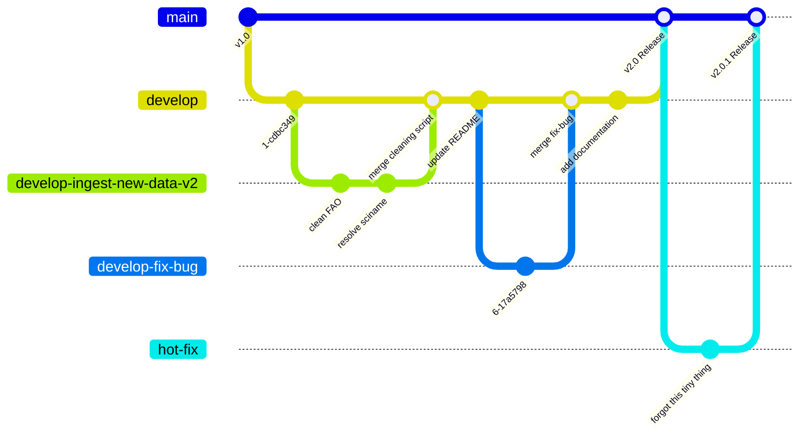

# ARTIS Model (Aquatic Resource Trade In Species)

This repository contains the ARTIS model codebase. This is where the Seafood Globalization team develops and maintains the ARTIS model, end-users will typically not need to follow the instalation instructions below.

ARTIS reconstructs global seafood supply chains by tracing trade flows and production data through a multi-stage allocation process. It enables detailed analysis of seafood consumption by country, species, and product form.

## What’s New in v1.1.0

- Major overhaul of the consumption calculation workflow (see below for high-level summary)
- For all changes see [CHANGELOG](./CHANGELOG.md) for details

### High‐Level Changes in `calculate_consumption.R`

- **Domestic Consumption (Stage 1)**  
   - **Domestic Production → Domestic Exports → Domestic Consumption**  
     1. Aggregate total production of each HS‐6 code (disaggregated from species using `X_long`).  
     2. Subtract “domestic exports” (i.e., what leaves each country under `dom_source == "domestic"`).  
     3. Warn if any country’s exports exceed production.  
   - Result: a per‐country, per‐HS‐6 volume of product that remains for domestic consumption.  

- **Foreign Consumption (Stage 2)**  
   - **Unprocessed Imports → Processed Exports → Two‐Stage Allocation**  
     1. **Reverse “processing”**: Using `reweight_W_long`, the code “unprocesses” the final‐product HS‐6 back to its original raw‐fish equivalents, creating a pool of what could be consumed or re‐exported.  
     2. **Stage 1 (Import Retention)**: For each importer, estimate how much of the processed product they consume immediately (i.e., “fishmeal,” “other,” or “direct human consumption”). Any remainder becomes a re‐export candidate.  
     3. **Stage 2 (Redistribution to Final Consumer)**: Take those re‐exports and allocate them to the next‐tier consumers based on trade proportions (`artis` → “foreign” flows).  
     4. Throughout, apply the same Data‐Check logic: ensure that “foreign consumption + domestic consumption ≈ total production + error exports”.

- **Per‐Capita Capping & Debug Mode**  
   - After fully assembling **domestic + foreign consumption**, the function now:  
     1. Joins in population data (`pop`) to calculate per‐capita seafood consumption for “direct human consumption.”  
     2. Identifies outliers (e.g., any country > 100 kg/person) and proportionally “caps” their total consumption back down to the threshold.  
     3. If `dev_mode = TRUE`, writes out a CSV of the largest consumption‐vs.‐production discrepancies so users can inspect and debug (as described under the manual’s “Data Quality & Diagnostics” section).

- **Smaller, Faster I/O with `.qs` Files**  
   - All intermediate tables (e.g., disaggregated species‐to‐HS volumes, processed/unprocessed flows, final consumption tables) are now serialized as `.qs` rather than RDS/CSV, dramatically reducing file size and read/write time.

- **Improved Error‐Handling & Data Checks**  
   - **Domestic Check**: Warn if any “domestic export” volume exceeds production (i.e., negative domestic consumption).  
   - **Foreign Check**: Compare ARTIS’s reported “domestic export” volumes against the function’s computed values—warn if they diverge by more than 1 ton.  
   - **NA/Negative Consumption**: Emit a clear warning if any final consumption records are NA or negative, matching the manual’s emphasis on internal consistency checks at each stage.

## Model Overview

ARTIS reconstructs seafood supply chains by:

- Integrating production data, international trade flows, and processing factors.
- Disaggregating national production to detailed product codes using trade proportions.
- Tracing each product through exports, imports, processing, and consumption pathways.
- Providing per-country, per-species, and per-product estimates of seafood availability and use.

### Spill the :coffee: (further details)

- [ARTIS Manual](https://seafood-globalization-lab.github.io/artis-manual/): Conceptual background, methods, output structure, data access.
- [CHANGELOG](./CHANGELOG.md): Complete change history with new ARTIS versions.
- [ARTIS Wiki](https://github.com/Seafood-Globalization-Lab/artis-model/wiki): Database table definitions, data sources, version mapping, new data ingest instructions. 

## How to Cite the ARTIS model (not the data)

> A formal dataset DOI will be posted here after the v1.1.0 release.  
> For now, cite the software as:

```
Jessica Gephart, Rahul Agrawal Bejarano, Althea Marks, & Kelvin Gorospe. (2024).
ARTIS input data and model. Knowledge Network for Biocomplexity. doi:10.5063/F1862DXT.
```

```bibtex
@software{artis-v1.1.0,
  title        = {ARTIS Model (Aquatic Resource Trade In Species), v1.1.0},
  author       = {Gephart, Jessica and Agrawal Bejarano, Rahul and Marks, Althea and Gorospe, Kelvin},
  year         = {2025},
  version      = {1.1.0},
  url          = {https://github.com/Seafood-Globalization-Lab/artis-model},
  note         = {Accessed: yyyy-mm-XX},
  institution  = {University of Washington},
  organization = {Seafood Globalization Lab},
  howpublished = {GitHub repository}
}
```

## Run Modes

- **local**: Run ARTIS on your local machine. Used for specific HS versions/years runs. See [Local run instrucitons](#installations) below.
  _Requires significant compute resources and is developed/tested on macOS with ARM64 (Apple Silicon) architecture._
- **aws**: Large-scale cloud runs on AWS Batch. See [`artis-hpc`](https://github.com/Seafood-Globalization-Lab/artis-hpc) for details. Numerous `if(run_env == "aws")` conditions throughout ARTIS pipeline that read and write files to and from S3 and the Docker artis-image instance running ARTIS. 
- **demo**: Fast, small test dataset for local runs and troubleshooting. (has not been maintained or checked recently) 

## Local ARTIS Run Instructions

### Installations - Local Prerequisites

- Python 3.12.x ([Download](https://www.python.org/downloads/release/python-31211/))
- R (tested with R 4.2.2) ([Download](https://www.r-project.org/))
- RStudio IDE ([Download](https://posit.co/download/rstudio-desktop/)) 
  - OR Positron IDE *a fork of VS Code that supports many more R features* ([Download](https://positron.posit.co/download))

### `artis` R Package Installation

- Get a local copy of the latest ARTIS release from Github
  ```zsh
  gh repo clone Seafood-Globalization-Lab/artis-model
  ```
- install the R package from the project root directory (run in console)
  ```R
  devtools::install()
  ```

### Python Environment

- Ensure your working directory is set to the project root (i.e. `/Users/theamarks/Documents/git-projects/artis-model`):
  ```sh
  pwd
  ```
- Create a new Python 3.12 environment 
  - **IF** you already have an up-to-date `./venv` in your project you can just run `source venv/bin/activate` to activate it and skip the following steps.
  - Check periodically that your local python version aligns with the `artis-hpc` `dockerfile` instalation of python.

  ```sh
  python3.12 -m venv venv
  ```
- Activate the environment:
  ```sh 
  source venv/bin/activate
  ```
- Upgrade base tooling used to install packages
  ```sh
  pip install --upgrade pip setuptools wheel
  ```
- Install package dependencies
  ```sh 
  pip install --no-deps -r requirements.lock
  ```

### Update Local Model Configuration

- Open `./00-local-machine-setup.R` 
- Change directory paths to appropriate data folders
- Adjust model parameters such as `running_sau`, `HS_year`, `test_years`, `estimate_data_type`, `prod_data_type`, and `dev_mode`.
- Save changes

### Clean and Structure Raw Data

- Open `./01-clean-input-data.R`
- Ensure required raw data files exist in the directory set as `datadir_raw` ([See this wiki page for details](https://github.com/Seafood-Globalization-Lab/artis-model/wiki/Ingest-New-FAO-Data-Instructions#required-raw-data-files---not-generated-by-script)).
- Run entire script to generate the ARTIS `model_inputs` folder.

  ```R
  source("01-clean-input-data.R")
  ```

### Run ARTIS model

- Open `./02-artis-pipeline.R`
- Ensure `run_env <- "local"` and `hs_version_run <- "12"` is set to the corresponding desired HS version. *Note*: 
  - years are set by `test_years` in `00-local-machine-setup.R`
  - Currently running ARTIS locally only runs a single HS version at a time through `02-artis-pipeline.R`. 
- Run entire script. This will take a substancial amount of compute and time. 
  ```R
  source("02-artis-pipeline.R")
  ```

### Build trade and consumption datafiles

- Open `./03-combine-tables.R`
- Run entire script to create a single `.parquet` file each for trade and consumption data
  ```R
  source("03-combine-tables.R")
  ```
- This step in the pipeline is run locally regardless if `02-artis-pipeline.R` was run locally or on AWS.

### Build Attribute tables

- Open `./04-create-metadata.R`
- Run entire script to build attribute tables useful for analysis.
  ```R
  source("04-create-metadata.R")
  ```
- This step in the pipeline is run locally regardless if `02-artis-pipeline.R` was run locally or on AWS.
- *Note:* `./04-create-metadata.R` amd `./05-prep-db-files.R` will be combined in the future

### Clean tables for database

- Open `./05-prep-db-files.R`
- Run entire script to standardize naming conventions and syntax for final tables. 
  ```R
  source("05-prep-db-files.R")
  ```
- This step in the pipeline is run locally regardless if `02-artis-pipeline.R` was run locally or on AWS.
- *Note:* `./04-create-metadata.R` amd `./05-prep-db-files.R` will be combined in the future

### Generate Package Citations

- Open `./06-cite-packages.R` 
- Run entire script to generate citations for package dependencies in the `artis` model. Use for attribution in published works. 

### Post Prossessing Data Validation

- Open `./07-post-processing-validation.Rmd`
- Run code chunk by chunk OR render the entire report to generate summary stats and figures to ensure the quality and assumption of ARTIS.
- *Note*: Rendering this file will take significant compute resources and may crash depending on your machine. 

## Development Workflow

### Branch Structure

- `main`: Stable releases
- `develop`: Ongoing development
- Task branches: `develop-*` (short-lived, merged back to `develop`)
- Hotfixes: branch from `main` for urgent fixes, merged back to `main`

### Branch Workflow Diagram


```mermaid
gitGraph
   commit id: "v1.0"
   branch develop
   commit
   branch develop-ingest-new-data-v2
   commit id: "clean FAO"
   commit id: "resolve sciname"
   checkout develop
   merge develop-ingest-new-data-v2 id: "merge cleaning script"
   checkout develop
   commit id: "update README"
   branch develop-fix-bug
   commit
   checkout develop
   merge develop-fix-bug id: "merge fix-bug"
   commit id: "add documentation"
   checkout main
   merge develop id: "v2.0 Release"
   branch hot-fix
   checkout hot-fix
   commit id: "forgot this tiny thing"
   checkout main
   merge hot-fix id: "v2.0.1 Release"
```

## System Requirements

> **Note:** See `requirements.txt` for Python package versions. R package versions still require additional documentation.

- **Platform:** macOS Ventura 13.3.1 (ARM64/M1/M2 strongly recommended)
- **R version:** 4.2.2
- **Python version:** 3.11.x
- **Key R packages:** data.table, dplyr, stringr, tidyverse, reticulate, etc. See `.renv_lock` file for package version details
- **Key Python packages:** qpsolvers, quadprog, cvxopt


## Model Visual Schematic

The following diagrams illustrate the core logic and processing steps of the ARTIS model:

- **Disaggregating Trade Records**:  
    
  _Shows how national-level production is mapped onto detailed product (HS) codes using trade information._

- **Aggregating Trade Records Back Up**:  
    
  _Demonstrates how disaggregated product flows are traced and summed back up to reconstruct consumption and trade balances._

- **Consumption Workflow**:  
    
  _Depicts the multi-stage allocation process: from production and trade through to final consumption estimates._

- **Codebase Structure Diagrams**:  
    
    
    
  _Visuals of the ARTIS codebase organization and major workflow steps._
