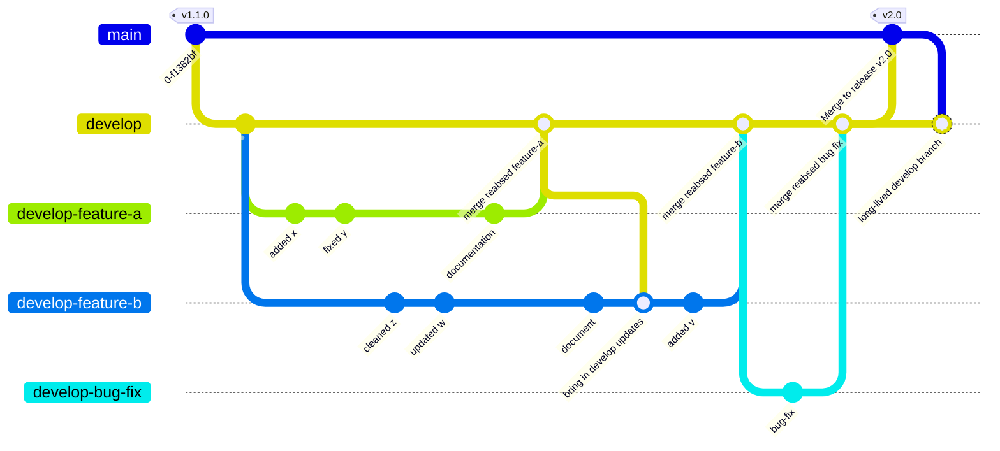
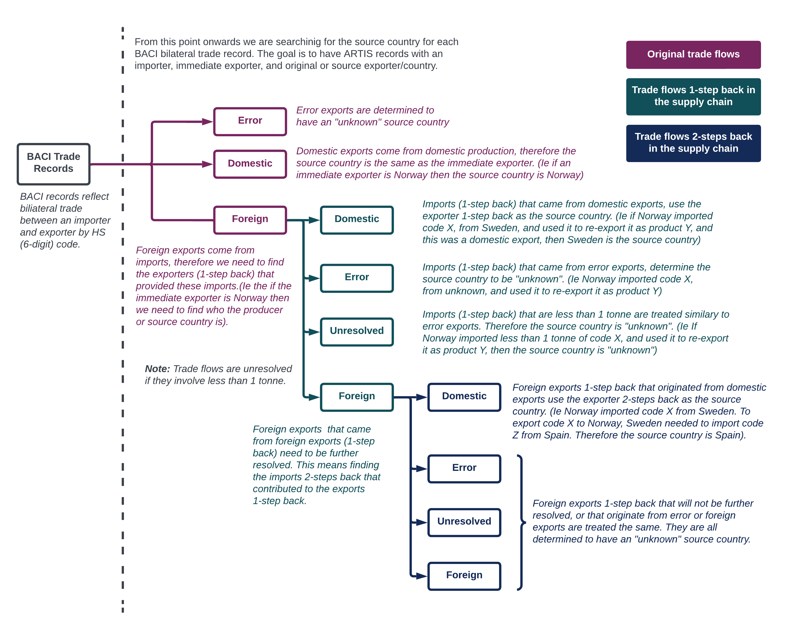
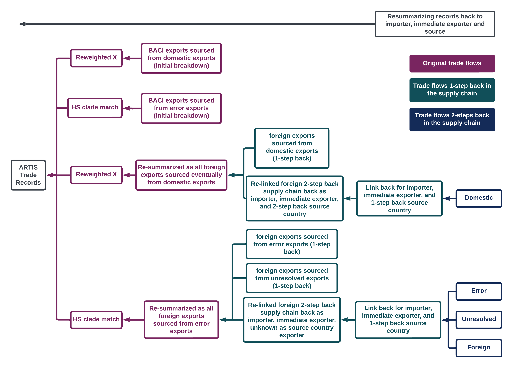
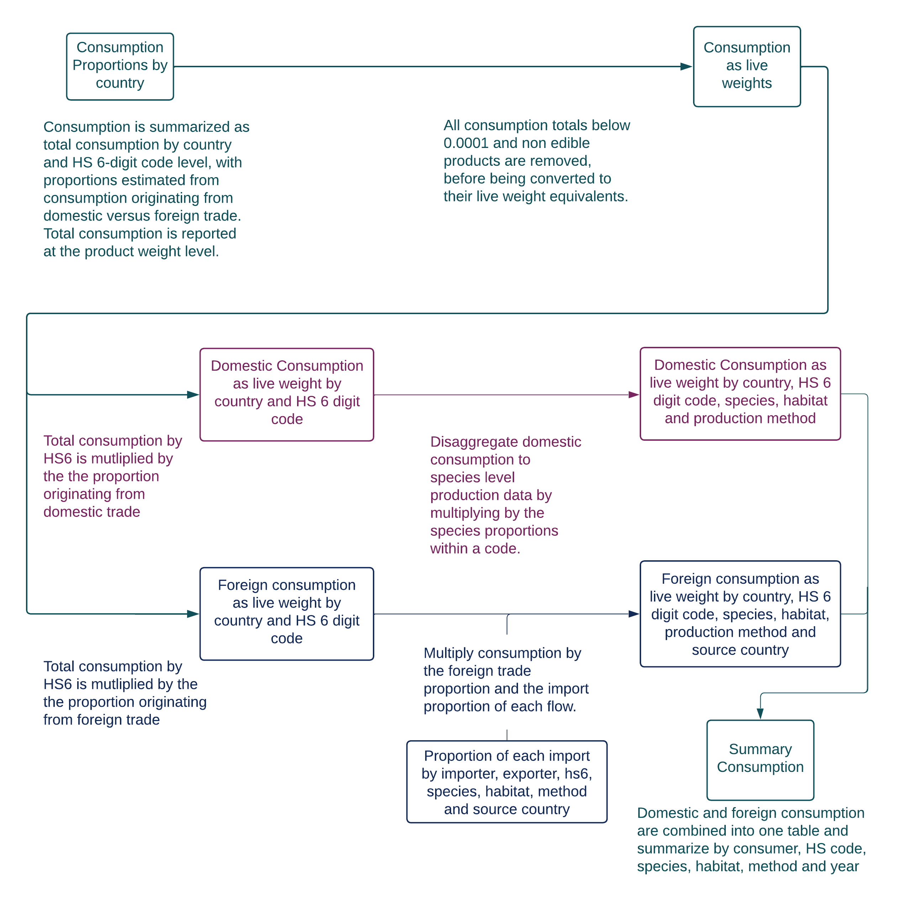
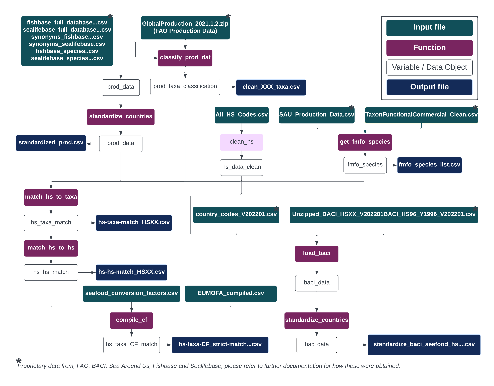
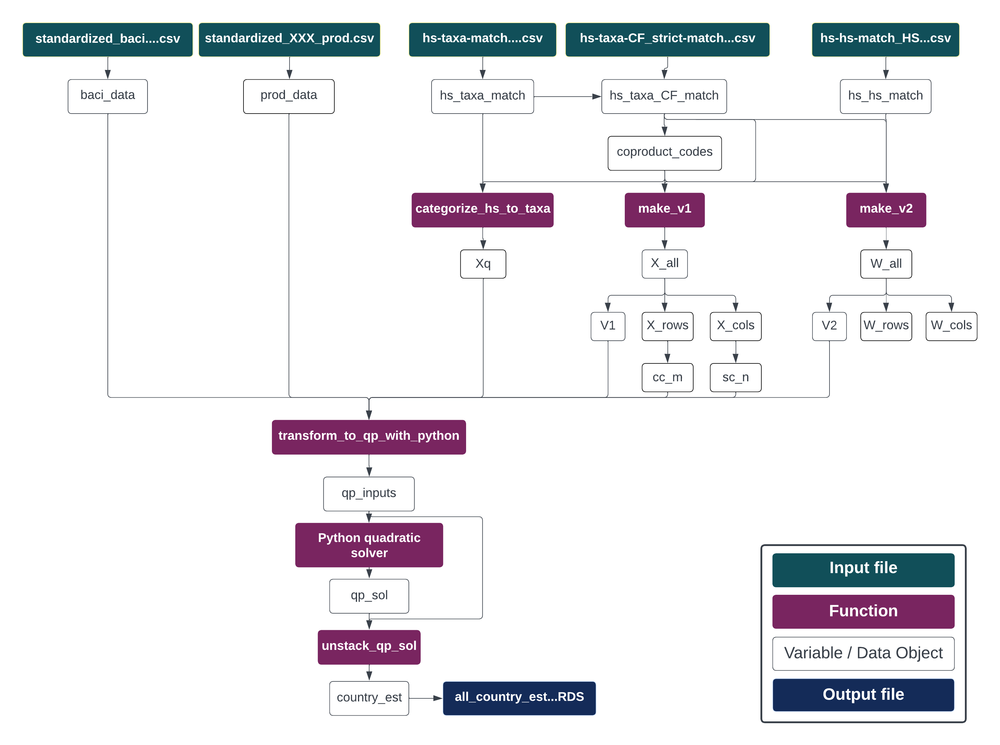
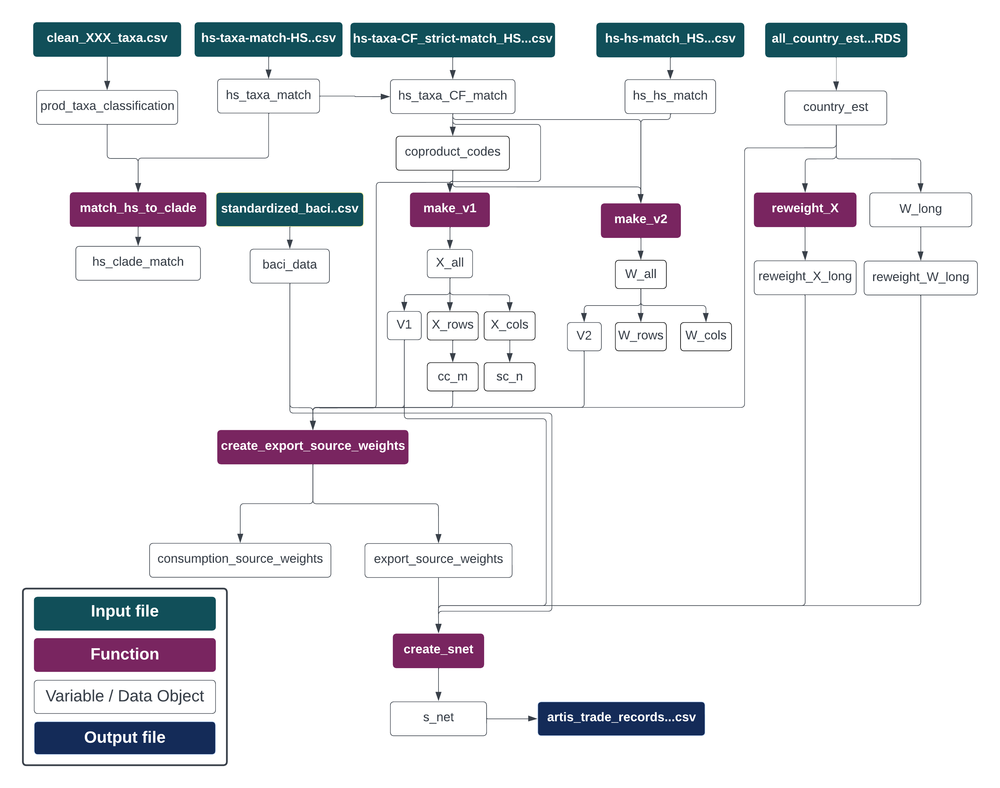

# ARTIS Model (Aquatic Resource Trade In Species)

This repository contains the ARTIS model codebase. This is where the Seafood Globalization team develops and maintains the ARTIS model, end-users will typically not need to follow the instalation instructions below.

ARTIS reconstructs global seafood supply chains by tracing trade flows and production data through a multi-stage allocation process. It enables detailed analysis of seafood consumption by country, species, and product form.

## Table of Contents

- [What’s New in v2.0](#whats-new-in-v20)
- [Model Overview](#model-overview)
- [How to Cite the ARTIS model (not the data)](#how-to-cite-the-artis-model-not-the-data)
- [Run Modes](#run-modes)
- [Local ARTIS Run Instructions](#local-artis-run-instructions)
- [Development Workflow / Contributing](#development-workflow--contributing)
- [GitFlow Git commands summary](#gitflow-git-commands-summary)
- [System Requirements](#system-requirements)
- [Model Visual Schematic](#model-visual-schematic)

## What’s New in v2.0

- Expanded data: ingested latest FAO production representing years 1996-2023, BACI v202501, Fishbase and Sealifebase 24.07 taxa information (see below for high-level summary).
- For all changes see [CHANGELOG](./CHANGELOG.md) for details

## Model Overview

ARTIS reconstructs seafood supply chains by:

- Integrating production data, international trade flows, and processing factors.
- Disaggregating national production to detailed product codes using trade proportions.
- Tracing each product through exports, imports, processing, and consumption pathways.
- Providing per-country, per-species, and per-product estimates of seafood availability and use.

### Spill the :coffee: (further details)

- [ARTIS Manual](https://seafood-globalization-lab.github.io/artis-manual/): Conceptual background, methods, output structure, data access.
- [CHANGELOG](./CHANGELOG.md): Complete change history with new ARTIS versions.
- [ARTIS Wiki](https://github.com/Seafood-Globalization-Lab/artis-model/wiki): Database table definitions, data sources, version mapping, new data ingest instructions. 

## How to Cite the ARTIS model (not the data)

> A formal dataset DOI will be posted here after the v2.0 release.  
> For now, cite the software as:

```
Jessica Gephart, Rahul Agrawal Bejarano, Althea Marks, & Kelvin Gorospe. (2024).
ARTIS input data and model. Knowledge Network for Biocomplexity. doi:10.5063/F1862DXT.
```

```bibtex
@software{artis-v2.0,
  title        = {ARTIS Model (Aquatic Resource Trade In Species), v2.0},
  author       = {Gephart, Jessica and Agrawal Bejarano, Rahul and Marks, Althea and Gorospe, Kelvin},
  year         = {2025},
  version      = {2.0},
  url          = {https://github.com/Seafood-Globalization-Lab/artis-model},
  note         = {Accessed: yyyy-mm-XX},
  institution  = {University of Washington},
  organization = {Seafood Globalization Lab},
  howpublished = {GitHub repository}
}
```

## Run Modes

- **local**: Run ARTIS on your local machine. Used for specific HS versions/years runs. See [Local run instrucitons](#installations) below.
  _Requires significant compute resources and is developed/tested on macOS with ARM64 (Apple Silicon) architecture._
- **aws**: Large-scale cloud runs on AWS Batch. See [`artis-hpc`](https://github.com/Seafood-Globalization-Lab/artis-hpc) for details. Numerous `if(run_env == "aws")` conditions throughout ARTIS pipeline that read and write files to and from S3 and the Docker artis-image instance running ARTIS. 
- **demo**: Fast, small test dataset for local runs and troubleshooting. (has not been maintained or checked recently) 

## Local ARTIS Run Instructions

### Installations - Local Prerequisites

- Python 3.12.x ([Download](https://www.python.org/downloads/release/python-31211/))
- R (tested with R 4.2.2) ([Download](https://www.r-project.org/))
- RStudio IDE ([Download](https://posit.co/download/rstudio-desktop/)) 
  - OR Positron IDE *a fork of VS Code that supports many more R features* ([Download](https://positron.posit.co/download))

### `artis` R Package Installation

- Get a local copy of the latest ARTIS release from Github
  ```zsh
  gh repo clone Seafood-Globalization-Lab/artis-model
  ```
- install the R package from the project root directory (run in console)
  ```R
  devtools::install()
  ```

### Python Environment

- Ensure your working directory is set to the project root (i.e. `/Users/theamarks/Documents/git-projects/artis-model`):
  ```sh
  pwd
  ```
- Create a new Python 3.12 environment 
  - **IF** you already have an up-to-date `./venv` in your project you can just run `source venv/bin/activate` to activate it and skip the following steps.
  - Check periodically that your local python version aligns with the `artis-hpc` `dockerfile` instalation of python.

  ```sh
  python3.12 -m venv venv
  ```
- Activate the environment:
  ```sh 
  source venv/bin/activate
  ```
- Upgrade base tooling used to install packages
  ```sh
  pip install --upgrade pip setuptools wheel
  ```
- Install package dependencies
  ```sh 
  pip install --no-deps -r requirements.lock
  ```

### Update Local Model Configuration

- Open `./00-local-machine-setup.R` 
- Change directory paths to appropriate data folders
- Adjust model parameters such as `running_sau`, `HS_year`, `test_years`, `estimate_data_type`, `prod_data_type`, and `dev_mode`.
- Save changes

### Clean and Structure Raw Data

- Open `./01-clean-input-data.R`
- Ensure required raw data files exist in the directory set as `datadir_raw` ([See this wiki page for details](https://github.com/Seafood-Globalization-Lab/artis-model/wiki/Ingest-New-FAO-Data-Instructions#required-raw-data-files---not-generated-by-script)).
- Run entire script to generate the ARTIS `model_inputs` folder.

  ```R
  source("01-clean-input-data.R")
  ```

### Run ARTIS model

- Open `./02-artis-pipeline.R`
- Ensure `run_env <- "local"` and `hs_version_run <- "12"` is set to the corresponding desired HS version. *Note*: 
  - years are set by `test_years` in `00-local-machine-setup.R`
  - Currently running ARTIS locally only runs a single HS version at a time through `02-artis-pipeline.R`. 
- Run entire script. This will take a substancial amount of compute and time. 
  ```R
  source("02-artis-pipeline.R")
  ```

### Build trade and consumption datafiles

- Open `./03-combine-tables.R`
- Run entire script to create a single `.parquet` file each for trade and consumption data
  ```R
  source("03-combine-tables.R")
  ```
- This step in the pipeline is run locally regardless if `02-artis-pipeline.R` was run locally or on AWS.

### Build Attribute tables

- Open `./04-create-metadata.R`
- Run entire script to build attribute tables useful for analysis.
  ```R
  source("04-create-metadata.R")
  ```
- This step in the pipeline is run locally regardless if `02-artis-pipeline.R` was run locally or on AWS.
- *Note:* `./04-create-metadata.R` amd `./05-prep-db-files.R` will be combined in the future

### Clean tables for database

- Open `./05-prep-db-files.R`
- Run entire script to standardize naming conventions and syntax for final tables. 
  ```R
  source("05-prep-db-files.R")
  ```
- This step in the pipeline is run locally regardless if `02-artis-pipeline.R` was run locally or on AWS.
- *Note:* `./04-create-metadata.R` amd `./05-prep-db-files.R` will be combined in the future

### Generate Package Citations

- Open `./06-cite-packages.R` 
- Run entire script to generate citations for package dependencies in the `artis` model. Use for attribution in published works. 

### Post Prossessing Data Validation

- Open `./07-post-processing-validation.Rmd`
- Run code chunk by chunk OR render the entire report to generate summary stats and figures to ensure the quality and assumption of ARTIS.
- *Note*: Rendering this file will take significant compute resources and may crash depending on your machine. 

OR 

- Open `./08-validation-single-HS-year.Rmd`
- Run code chunk by chunk OR render the entire report to generate summary stats and figures to ensure the quality and assumption of ARTIS for a single HS version / year pairing. Indented for local testing. 

## Development Workflow / Contributing

The `artis-model` repo follows a GitFlow style branching workflow described below.

### Branch Structure

- `main`: Stable releases only (long-lived)
- `develop`: Ongoing development integration (long-lived)
- `develop-*` Feature branches created off of `develop`. Merged back to `develop` for stagging and testing (e.g., `develop-FAO-2025-data`)(short-lived)
- Hotfixes: branch from `main` for urgent fixes, merged back to `main` (short-lived)

All work should be done in **feature branches** and integrated back into `develop` using rebasing to maintain a linear history.

### Branch Workflow Diagram


```mermaid
gitGraph
   commit tag: "v1.1.0"
   branch develop
   checkout develop
   commit id: " "
   branch develop-feature-a
   commit id: "added x"
   commit id: "fixed y"
   checkout develop
   branch develop-feature-b
   commit id: "cleaned z"
   commit id: "updated w"
   checkout develop-feature-a
   commit id: "documentation"
   checkout develop
   merge develop-feature-a id: "merge reabsed feature-a"
   checkout develop-feature-b
   commit id: "document"
   merge develop id: "bring in develop updates"
   commit id: "added v"
   checkout develop
   merge develop-feature-b id: "merge reabsed feature-b"
   checkout develop
   branch develop-bug-fix
   commit id: "bug-fix"
   checkout develop
   merge develop-bug-fix id: "merge reabsed bug fix"
   checkout main
   merge develop id: "Merge to release v2.0" tag: "v2.0" type: NORMAL 
   checkout develop
   merge main id: "long-lived develop branch"
```

## GitFlow Git commands summary

### Create Feature Branch

Start from the latest `develop` branch

```zsh
# Make sure develop is up to date
git checkout develop
git pull origin develop

# Create and switch to your new feature branch
git checkout -b develop-<feature-name>
```

### Work on the Feature

Commit your changes frequently with clear messages:

```zsh
git add <files>
git commit -m "Fix: correct handling of missing common names in 01-clean-input-data so multiple names are concatinated into a single value"
```

Update your branch on GitHub:

```zsh
git fetch
git rebase
git push
```

### Rebase onto `develop` Before Integration/Pull Request

Keep your branch up to date by rebasing against `develop`. This avoids merge conflicts and keeps a clean linear history. Rebasing takes all of your feature branch changes and replays/puts them all onto the tip/end of the `develop` commit history. This will only effect your feature branch and will not change `develop` until you merge into `develop`.

```zsh
# Update your local copy of develop
git checkout develop
git pull origin develop

# Rebase your feature branch onto develop version on GitHub (only effect feature branch)
git checkout develop-<feature-name>
git rebase origin/develop
```

Update your GitHub feature branch: You need to force-push since rebase rewrites history. --force-with-lease is safer than --force — it will refuse if someone else pushed to the remote branch since your last fetch, protecting against accidental overwrites.
```zsh
git push --force-with-lease
```

If there are conflicts, resolve them, then continue:

```zsh
git add <conflicted-files>
git rebase --continue
```

### Open a Pull Request (PR) to merge feature-branch into `develop`

- on GitHub `artis-model` repo open the ["Pull Rquest" tab](https://github.com/Seafood-Globalization-Lab/artis-model/pulls) 
- Click green "New pull request" button
- Set `base:develop` 
- Set `compare:develop-your-feature-branch`
- Click green "Create pull request" button
- Completely and acurately fill in pull request template in the description and ensure all requirements are met before creating the pull request. 
- Assign a reviewer in the right side column and fill in any other relevant metadata about the PR and work. Remember that the person submitting the PR is responsible for testing and ensuring their changes run smoothly and do not introduce breaking changes. 

### Github Automated Workflows (GitHub Actions)

- Run `R-CMD-Check` on code integrated into `main` or `develop` branches via a PR. This ensures that the R `artis` package has correct documentation, declared dependencies, and build successfully.  
- Change the status of issues linked in a PR to "QA / Staging". The issues can already be in the `ARTIS Maintence & Analysis` project or not, all will be added to the project and statuses updated. This helps keep the project clean and clearly identify what stage of development issues are in. 

## System Requirements

> **Note:** See `requirements.txt` for Python package versions. R package versions still require additional documentation.

- **Platform:** macOS Ventura 13.3.1 (ARM64/M1/M2 strongly recommended)
- **R version:** 4.2.2
- **Python version:** 3.11.x
- **Key R packages:** data.table, dplyr, stringr, tidyverse, reticulate, etc. See `.renv_lock` file for package version details
- **Key Python packages:** qpsolvers, quadprog, cvxopt


## Model Visual Schematic

The following diagrams illustrate the core logic and processing steps of the ARTIS model:

- **Disaggregating Trade Records**:  
    
  _Shows how national-level production is mapped onto detailed product (HS) codes using trade information._

- **Aggregating Trade Records Back Up**:  
    
  _Demonstrates how disaggregated product flows are traced and summed back up to reconstruct consumption and trade balances._

- **Consumption Workflow**:  
    
  _Depicts the multi-stage allocation process: from production and trade through to final consumption estimates._

- **Codebase Structure Diagrams**:  
    
    
    
  _Visuals of the ARTIS codebase organization and major workflow steps._
